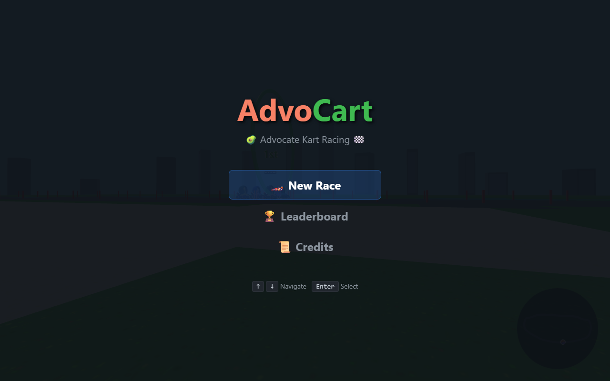
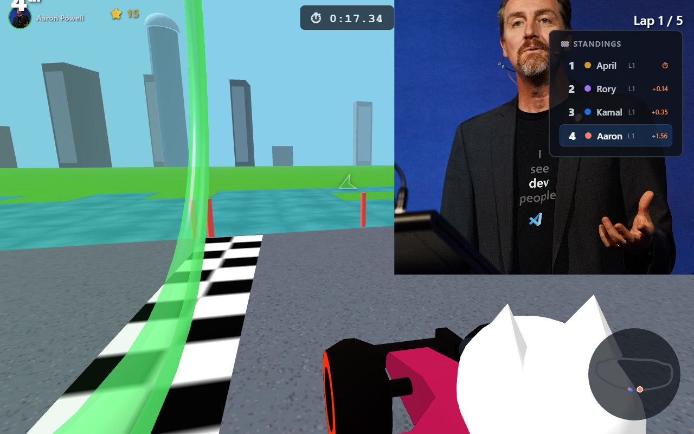
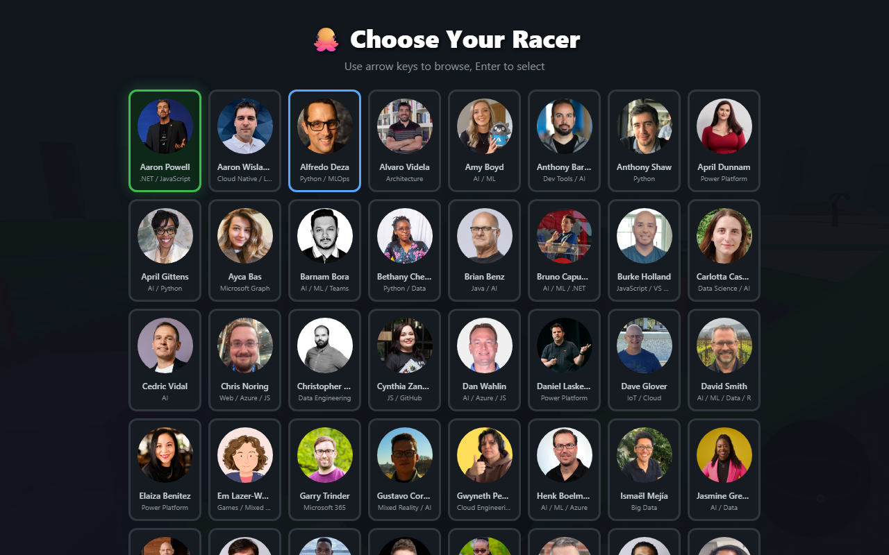
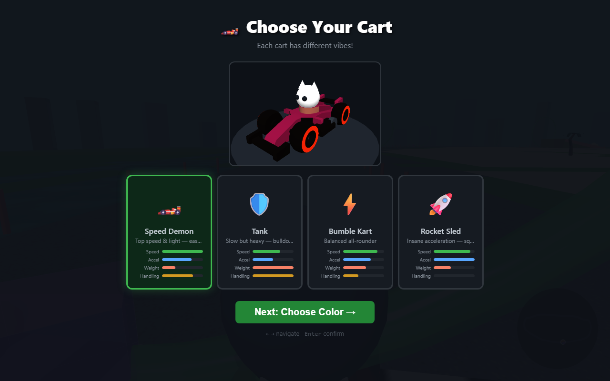
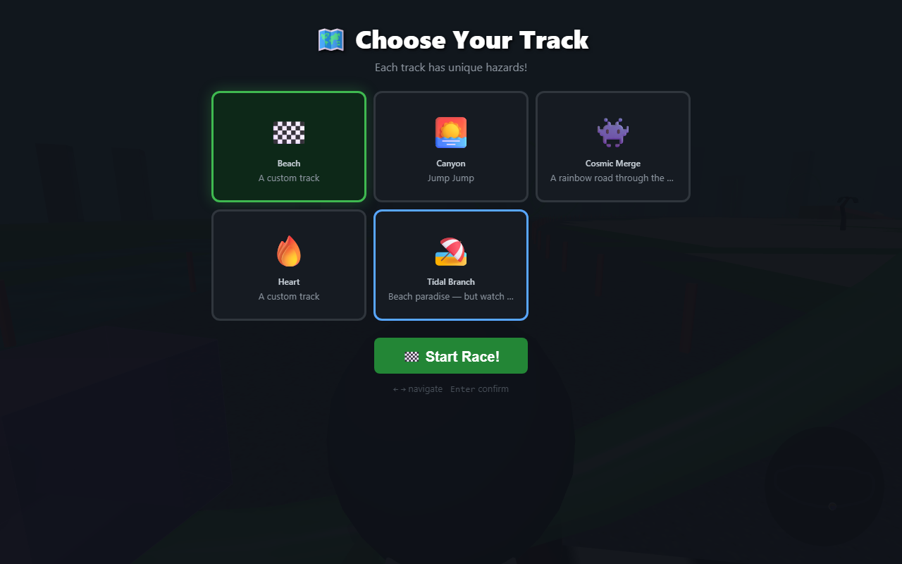
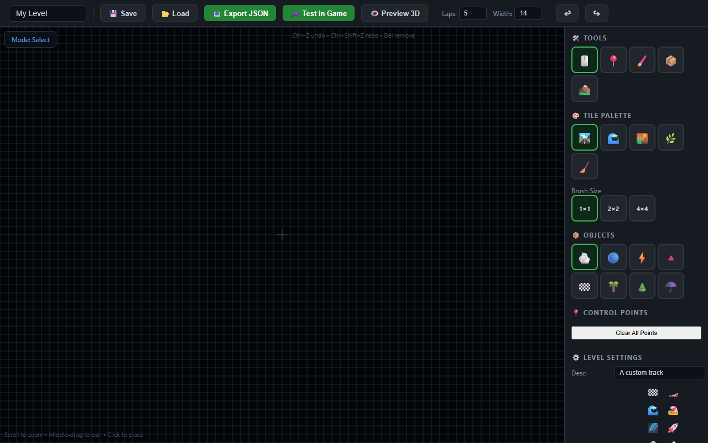
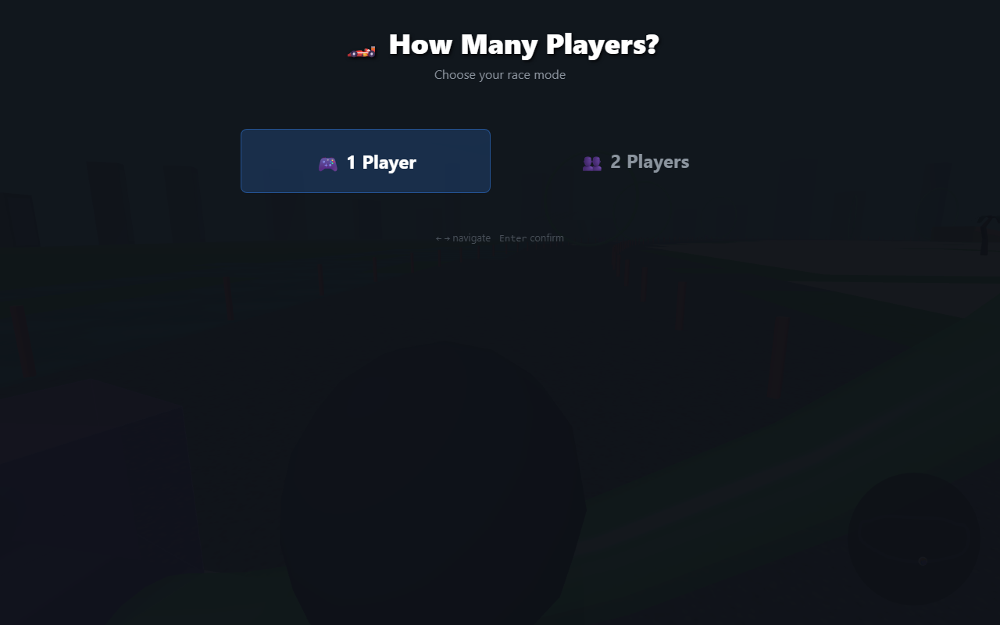
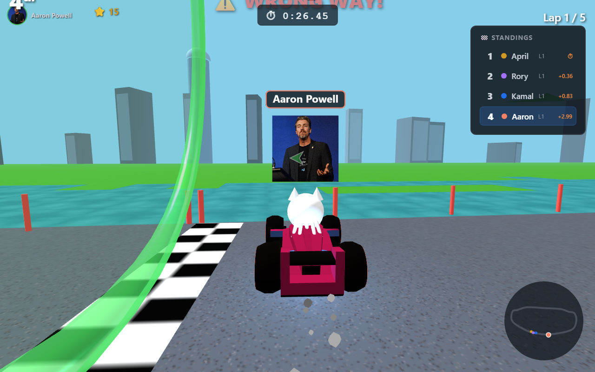
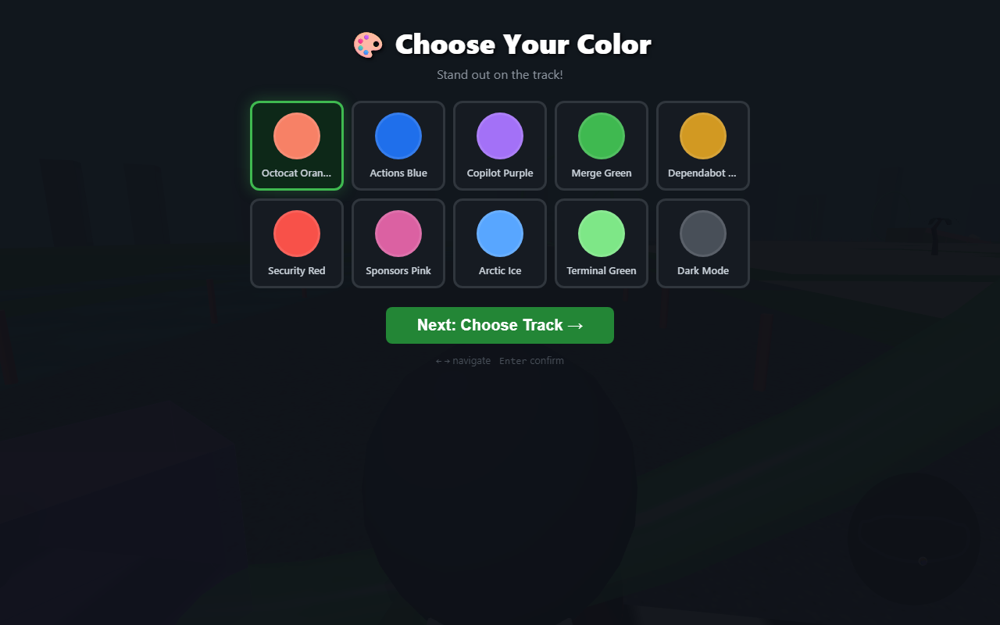
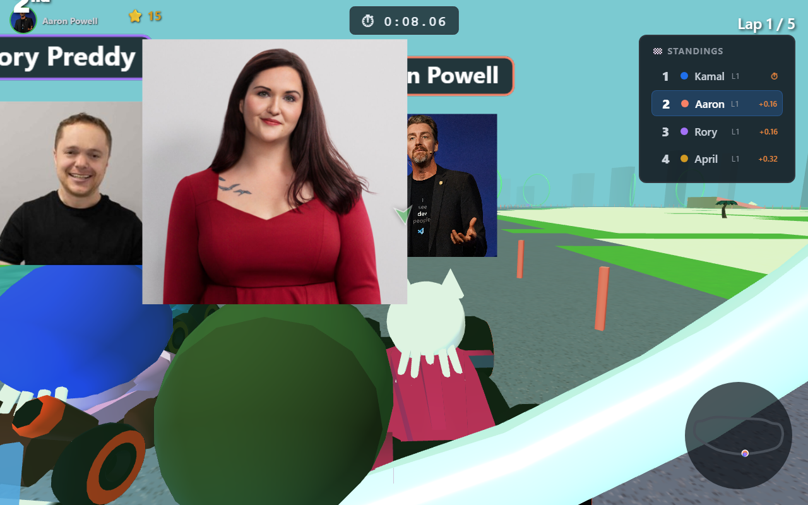

# 🥑 AdvoCart Legends

**A Mario Kart-style 3D racing game built with Three.js — featuring Microsoft Cloud Advocates as racers!**

🎮 **[Play Now →](https://softchris.github.io/advocacy-cart/)**



---

## 🏁 Features

- **3D Kart Racing** — Full 3D tracks with ramps, water hazards, rings, and boundaries
- **60+ Playable Characters** — Real Microsoft Cloud Advocates with photos and specialties
- **5 Unique Tracks** — Beach, Canyon, Cosmic Merge, Heart, and Tidal Branch
- **1P & 2P Split-Screen** — Race against AI or challenge a friend on the same keyboard
- **GLB Kart Models** — Multiple kart styles with color customization
- **GitHub-Themed Powerups** — Throw Dependabot shells, deploy GitHub Actions, trigger 404 errors, and more
- **Thruster Effects** — Karts light up with blue (or orange during boost!) thruster flames
- **HUD & Leaderboard** — Live standings, lap counter, speed bar, minimap, and race timer
- **Podium Celebration** — 3D podium with fireworks, orbiting camera, and a cheering octocat crowd
- **Level Editor** — Build your own tracks with a full-featured tile-based editor
- **CC0 Music** — 5 original tracks by Zane Little Music (Public Domain)
- **Full Keyboard Navigation** — Every screen is navigable without a mouse



---

## 🎮 Controls

### Single Player

| Action | Keys |
|--------|------|
| Accelerate | `↑` or `W` |
| Brake / Reverse | `↓` or `S` |
| Turn Left | `←` or `A` |
| Turn Right | `→` or `D` |
| Use Powerup | `Space` |
| Pause | `Escape` |

### 2-Player Split-Screen

| Action | Player 1 | Player 2 |
|--------|----------|----------|
| Accelerate | `W` | `↑` |
| Brake | `S` | `↓` |
| Turn Left | `A` | `←` |
| Turn Right | `D` | `→` |
| Use Powerup | `Q` | `Space` |

---

## 🚀 Getting Started

### Play Online

Just visit **[softchris.github.io/advocacy-cart](https://softchris.github.io/advocacy-cart/)** — no install needed!

### Run Locally

```bash
# Clone the repo
git clone https://github.com/softchris/advocacy-cart.git
cd advocacy-cart

# Start the local server
node editor/server.js

# Open in browser
# http://localhost:8080
```

> The local server is needed for loading GLB models, level JSON files, and music assets.

---

## 🏎️ How to Play

1. **New Race** → Choose 1 Player or 2 Player mode
2. **Pick Your Racer** — Browse the advocate grid, each with their own specialty
3. **Choose a Kart** — Standard, Speed Demon, or Future styles
4. **Pick a Color** — 8 colors to choose from
5. **Select a Track** — 5 tracks with different themes and music







### Powerups

Drive through pickup boxes on the track to collect powerups:

| Powerup | Effect |
|---------|--------|
| 🐙 **Dependabot Shell** | Homing projectile that targets the racer ahead |
| 🚀 **GitHub Actions** | Speed boost for several seconds |
| 🔀 **Merge Conflict** | Spins out nearby opponents |
| ⭐ **Star Power** | Temporary invincibility + speed |
| 🔧 **Copilot Assist** | Auto-steers you back on track |
| 🚫 **404 Not Found** | Creates an obstacle on the track |

---

## 🗺️ Tracks

| Track | Theme | Music |
|-------|-------|-------|
| 🏖️ Beach | Coastal with palm trees and water | Beach vibes |
| 🏜️ Canyon | Desert with cacti and rock formations | Epic orchestral |
| 🌌 Cosmic Merge | Space with stars and nebulae | Space ambient |
| 💚 Heart | Heart-shaped green track | Retro synth |
| 🌊 Tidal Branch | Ocean-themed with branching paths | City groove |

---

## 🛠️ Level Editor

The built-in level editor lets you create custom tracks with a visual tile-based interface.

**Access it at:** `http://localhost:8080/editor/editor.html`



### Editor Features

- **Tile Painting** — Paint road, grass, water, sand, and dirt tiles
- **Brush Sizes** — 1×1, 2×2, or 4×4 tile brushes
- **Control Points** — Place waypoints that define the racing line
- **Objects** — Add rocks, trees, boost pads, ramps, rings, checkered flags, and more
- **3D Preview** — Preview your track in 3D before playing
- **Test in Game** — Jump straight into racing on your custom track
- **Save / Load** — Save tracks as JSON files
- **Export** — Export track JSON for sharing

### Editor Tools

| Tool | Description |
|------|-------------|
| 🎨 Tile Brush | Paint terrain tiles on the grid |
| 📍 Control Points | Place waypoints that define the track path |
| ✏️ Eraser | Remove tiles and objects |
| 📦 Object Placer | Place decorative and gameplay objects |
| 🏔️ Height Brush | Adjust terrain elevation |

### Editor Controls

| Action | Input |
|--------|-------|
| Place tile/object | Left click |
| Remove | `Del` key |
| Pan view | Middle mouse drag |
| Zoom | Scroll wheel |
| Undo | `Ctrl+Z` |
| Redo | `Ctrl+Shift+Z` |

### Level Settings

Each level includes configurable settings:
- **Track name & description**
- **Number of laps** (default: 5)
- **Grid width** (default: 14)
- **Background scene** (city skyline, space, beach, etc.)
- **Music track** selection

---

## 📸 Screenshots

| Menu | Mode Select | Racing |
|------|-------------|--------|
|  |  |  |

| Character Select | Color Select | Countdown |
|-----------------|--------------|-----------|
|  |  |  |

---

## 🏗️ Tech Stack

- **Three.js** (r128) — 3D rendering
- **Vanilla JavaScript** — No frameworks, single `index.html`
- **Web Audio API** — Procedural sound effects
- **HTML5 Audio** — MP3 music playback
- **GLB/glTF** — 3D kart and nature models
- **GitHub Pages** — Hosting

---

## 📁 Project Structure

```
advocacy-cart/
├── index.html              # The entire game (~6000+ lines)
├── editor/
│   ├── editor.html         # Level editor
│   └── server.js           # Local dev server (Node.js)
├── levels/
│   ├── manifest.json       # Level registry
│   ├── beach.json          # Track definitions
│   ├── canyon.json
│   ├── cosmic-merge.json
│   ├── heart.json
│   └── tidal-branch.json
├── models/
│   ├── karts/              # GLB kart models + textures
│   └── nature/             # Trees, rocks, plants, fences
├── assets/
│   └── music/              # CC0 MP3 tracks
└── screenshots/            # README images
```

---

## 🎵 Credits

- **Music**: [Zane Little Music](https://opengameart.org/users/zane-little-music) — CC0 (Public Domain) via OpenGameArt.org
- **3D Models**: [Kenney.nl](https://kenney.nl) — CC0 assets
- **Character Photos**: Microsoft Cloud Advocates
- **Built with**: [Three.js](https://threejs.org/)

---

## 📄 License

MIT
